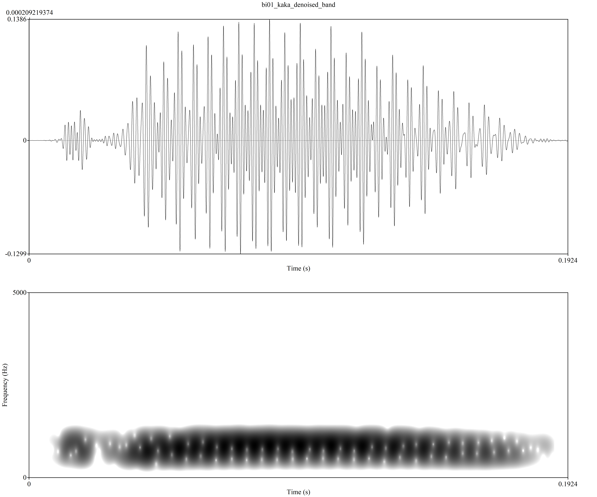

**Author**: Ivan Andreu Rascon  
**Date**: Last update: `r Sys.time()`


# Overview


# Description of the assignment

In this programming assignment I worked on a relatively large project production of 6 participants. I used Praat to normalize the scale peak intensity, create textgrids and annotate them. After fixing the extra “#” on that made the code not work, adding the number of files and changing the names I calculated values for (f1, f2, vot) and put then on a CVS file. 

# Hypothesis

Based on the article I presented in class Bradlow (1995) F1  and F2 values should be higher for native English of English in comparison with Spanish-English bilinguals. 

In relation with the VOTs analysis, the l2 learners, might have longer VOTs than the bilinguals, due to the stop consonant differences between Spanish and English. This is because Spanish has a short and lead lag, and English has short, long, and lead lag. 


# Prep

## Libraries

```{r}
```{r, 'load-libs', echo=T, warning=F, message=F}
library(tidyverse)
library(untidydata)
library(ggplot2)
library(readr)
library(dplyr)
library(knitr)
library(here)
```

```


```

## Load data

```{r}
bi01 <- read_csv("../data/bi01.csv") 
bi02 <- read_csv("../data/bi02.csv")
bi03 <- read_csv("../data/bi03.csv")
ne01 <- read_csv("../data/ne01.csv")
ne02 <- read_csv("../data/ne02.csv")
ne03 <- read_csv("../data/ne03.csv")

datos = bind_rows(bi01, bi02, bi03, ne01, ne02, ne03)   

```

## Tidy data

```{r}
#| label: tidy-data
# Convert from long to wide or wide to long format as necessary (check 
# examples from class)
# Create any other relevant variables here 

datos = separate(data = datos, col = fileID, into = c("id", "word"), sep = "_")
datos = separate(data = datos, col = word, into = c("word", "trial"), sep = "(?<=[A-Za-z])(?=[0-9])", extra = "drop", fill = "right")
datos = separate(data = datos, col = id, into = c("group", "id"), sep = "(?<=[A-Za-z])(?=[0-9])")


glimpse(datos)

```

# Analysis

## Descriptives


```{r, 'descriptive-stats2'}
means = datos %>%
  group_by(group) %>%
  summarise(mean_f1 = mean(f1), sd_f1 = sd(f1), mean_f2 = mean(f2), sd_f2 = sd(f2), mean_vot = mean(vot), sd_vot = sd(vot), n = n())
kable(means, caption = "**Means and SD per group**")
```

```{r, 'descriptive-stats3'}
table <- datos %>%
  group_by(group) %>%
  summarise(mean_vot = mean(vot), sd_vot = sd(vot), n = n())
kable(table, caption = "**Mean VOT per group**")
```


```{r}

```
-----


```{r, 'descriptive-statss'}
# Give some descriptive summaries of your data 
# Display your descriptives in a table

table <-datos %>%
  group_by(group, word) %>%
  summarize(meanf1 = mean(f1), sdf1 = sd(f1), meanf2 = mean(f2), sdf2 = sd(f2), meanvot = mean(vot), sdvot = sd(vot), n = n() )
kable(table, caption = "table")


table2 <-datos %>%
  group_by(group, word) %>%
  summarize(mean(vot), sd(vot))
kable(table2, caption = "table2")
```


## Visualization

```{r}
#| label: plots 
#| fig.retina: 2
# Include some plots here

```


```{r}

ggplot(datos, aes(x = group, y = vot)) +
  geom_point(aes(color = group))

```


```{r}

datos %>% 
  ggplot(.,aes(x=vot, y=word, color=id))+
  geom_point( size=3, color="green", fill=alpha("blue", 0.2), alpha=0.4, shape=21, stroke=2)


```


```{r}
plot = filter(datos, word == "taka" | word == "teke" | word == "tiki" | word == "toko" | word == "tuku")
ggplot(data = plot, aes(x=word, y=vot, color=group)) + 
  geom_point( size=3, color="red", fill=alpha("black", 0.2), alpha=0.4, shape=21, stroke=2) +
  labs(title = "VOT  function of vowel type and group", y = "VOT", x = "Vowel type")


```


Below I am including an image that represents F1 and F2 of /u/ in the first syllable of /kuku/ of a Spanish-English bilingual


```{r}

#Here I attach an image that represents F1 and F2 of /a/ in the first syllable of /kaka/ of a Spanish-English bilingual. VOT differences can algo be distinguished. 



#Here I attach an image that represents F1 and F2 of /a/ in the first syllable of /kaka/ of a L2 native of english. VOT differences can also be distinguished. 

#Native English speakers seem to have longer lag VOT than bilniguals.


knitr::include_graphics('../images/en.png')
```


# As seen in Bradlow(1995) F1  and F2 values should be higher for native English of English in comparison with Spanish-English bilinguals. 


```{r}
# Include some plots here

plot = filter(datos, word == "kuku" | word == "puku" | word == "tuku")
ggplot(plot, aes(x=word, y=f2, fill=group)) + 
    geom_boxplot()+ geom_point( size=3, color="red", fill=alpha("yellow", 0.2), alpha=0.4, shape=21, stroke=2)+
  facet_wrap(~group)+
  labs(title = "F2 of /u/ stop  and group", y = "F2", x = "Stop type /p/ /t/ /k/")


```


```{r}
# Include some plots here

plot = filter(datos, word == "keke" | word == "peke" | word == "teke")
ggplot(plot, aes(x=word, y=f2, fill=group)) + 
    geom_boxplot()+ geom_point( size=3, color="red", fill=alpha("green", 0.2), alpha=0.4, shape=21, stroke=2)+
  facet_wrap(~group)+
  labs(title = "F2 of /e/ stop  and group", y = "F2", x = "Stop type /p/ /t/ /k/")


```


```{r}
# Include some plots here

plot = filter(datos, word == "kiki" | word == "piki" | word == "tiki")
ggplot(plot, aes(x=word, y=f2, fill=group)) + 
    geom_boxplot()+ geom_point( size=3, color="red", fill=alpha("blue", 0.2), alpha=0.4, shape=21, stroke=2)+
  facet_wrap(~group)+
  labs(title = "F2 of /i/ stop  and group", y = "F2", x = "Stop type /p/ /t/ /k/")


```


```{r}
# Include some plots here

plot = filter(datos, word == "koko" | word == "poko" | word == "toko")
ggplot(plot, aes(x=word, y=f2, fill=group)) + 
    geom_boxplot()+ geom_point( size=3, color="red", fill=alpha("blue", 0.2), alpha=0.4, shape=21, stroke=2)+
  facet_wrap(~group)+
  labs(title = "F2 of /o/ stop  and group", y = "F2", x = "Stop type /p/ /t/ /k/")


```


```{r}
# Include some plots here

plot = filter(datos, word == "kaka" | word == "paka" | word == "taka")
ggplot(plot, aes(x=word, y=f2, fill=group)) + 
    geom_boxplot()+
  facet_wrap(~group)+ geom_point( size=3, color="red", fill=alpha("blue", 0.2), alpha=0.4, shape=21, stroke=2)+
  labs(title = "F2 of /a/ stop  and group", y = "F2", x = "Stop type /p/ /t/ /k/")


```


```{r}

plot = filter(datos, word == "keke" | word == "peke" | word == "teke")
ggplot(plot, aes(x=f2, y=f1, color = group, shape = group)) + 
    geom_point(size=3, alpha=0.7)+
  labs(title = "F1 and F2 of /e/ per group", y = "F1", x = "F2")


```


```{r}

plot = filter(datos, word == "kiki" | word == "piki" | word == "tiki")
ggplot(plot, aes(x=f2, y=f1, color = group, shape = group)) + 
    geom_point(size=3, alpha=0.7)+
  labs(title = "F1 and F2 of /i/ per group", y = "F1", x = "F2")


```


```{r}

plot = filter(datos, word == "kuku" | word == "puku" | word == "tuku")
ggplot(plot, aes(x=f2, y=f1, color = group, shape = group)) + 
    geom_point(size=3, alpha=0.7)+
  labs(title = "F1 and F2 of /u/ per group", y = "F1", x = "F2")


```


```{r}
plot = filter(datos, word == "koko" | word == "poko" | word == "toko")
ggplot(plot, aes(x=f2, y=f1, color = group, shape = group)) + 
    geom_point(size=3, alpha=0.7)+
  labs(title = "F1 and F2 of /o/ per group", y = "F1", x = "F2")

```


-->

## Hypothesis test

```{r}
#| label: stats
# Conduct a simple statistical analysis here (optional)

```


# Conclusion

As seen on the plots, native English speakers seem to have longer lag VOT's than bilniguals. This is because Spanish has a short and lead lag, and English has short, long, and lead lag. 


In relation with my initial hypothesis from Bradlow (1995) the values (F1 and F2) are slightly higher, therefore the present study seems to corroborate the findings. 
